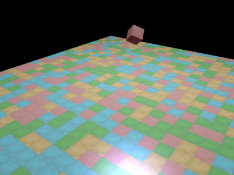

# Cube Game

A small OpenGL project, started by following along with [LearnOpenGL](https://learnopengl.com/).

Basically just a free-moving camera, a map of tiles, a rotating block, and some basic lighting.

